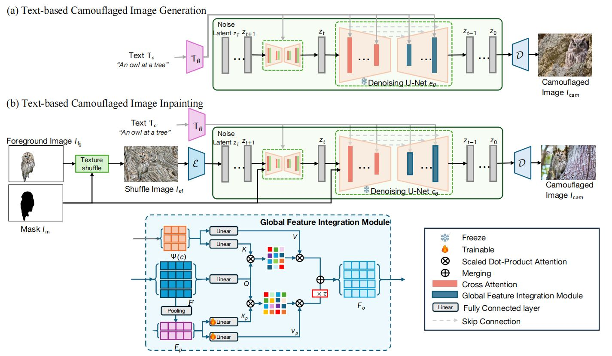

# CamouDiff: Semantic Meaningful Camouflage Image Generation

## Abstract
Camouflage image generation offers a cost-effective solution to data scarcity in camouflaged vision perception, reducing reliance on manual annotation. However, existing methods often lack semantic coherence and global structural consistency, as they typically blend foregrounds into backgrounds or synthesize scenes using low-level textures, resulting in unrealistic outputs.
To address these issues, we propose CamouDiff, a diffusion-based model for camouflage image synthesis guided by text prompts. CamouDiff harnesses the generative power of pretrained text-to-image diffusion models and introduces a novel Global Feature Integration Module (GFIM) to enhance alignment between local object features and global scene context. GFIM injects global style cues via a modified cross-attention mechanism, ensuring holistic texture and color consistency.
We also present CamouImageSet, a curated dataset of high-quality camouflage-style images to support training. Extensive experiments across multiple benchmarks show that CamouDiff significantly outperforms existing methods in camouflage realism and foreground-background integration, advancing the field of camouflaged vision perception.

## Framework Overview


## Dataset (CamouImageSet)

CamouImageSet is a large‑scale synthesized camouflage dataset for camouflaged object generation and detection.
- Total valid camouflaged samples: **32,561**
- Contains paired synthetic camouflage images, source images, object masks, and text descriptions
- Diverse object categories and complex background textures
- Filtered by multi‑dimensional quantitative metrics (ICS, GCC, LCC, BndVis, Aes) and BLIP‑2 semantic validation to guarantee camouflage quality

You can download the CamouImageSet dataset via the provided link.
After downloading, unzip the files and place them into your target dataset directory for training and evaluation.

> Dataset statistics and comparisons against existing COD benchmarks are reported in our paper.

## Installation
```bash
git clone https://github.com/msxie92/CamouDiff.git
cd CamouDiff

# create environment
conda create -n camoudiff python=3.10
conda activate camoudiff

pip install -r requirements.txt
```

## Training Script

Train the CamouDiff diffusion model on camouflage datasets.

```
# Train base SDXL camouflage generation model
python tutorial_train_sdxl.py \
  --pretrained_model_name_or_path PATH_TO_SDXL_BASE \
  --train_data_dir PATH_TO_TRAIN_DATASET \
  --mixed_precision fp16 \
  --resolution 1024 \
  --train_batch_size 2 \
  --dataloader_num_workers 2 \
  --learning_rate 1e-4 \
  --weight_decay 0.01 \
  --output_dir PATH_TO_SAVE_CKPT \
  --save_steps 5000

# Train SDXL inpainting-based camouflage generation model
python tutorial_train_sdxl_inp.py \
  --pretrained_model_name_or_path PATH_TO_SDXL_INPAINT \
  --train_data_dir PATH_TO_TRAIN_DATASET \
  --mixed_precision fp16 \
  --resolution 1024 \
  --train_batch_size 2 \
  --dataloader_num_workers 2 \
  --learning_rate 1e-4 \
  --weight_decay 0.01 \
  --output_dir PATH_TO_SAVE_CKPT \
  --save_steps 5000 \
  --mask_mode 1
```

## Training Arguments
- `pretrained_model_name_or_path`: Pre-trained SDXL base/inpainting checkpoint path
- `train_data_dir`: Path to your training camouflage dataset
- `resolution`: Image resolution for training
- `learning_rate` / `weight_decay`: Optimizer hyperparameters
- `output_dir`: Directory to store model checkpoints and logs
- `save_steps`: Interval for saving checkpoints
- `mask_mode`: Enable mask-guided training for inpainting-based camouflage generation

## Test Scripts
```
python test_camou.py \
  --input_path ./demo/test.jpg \
  --output_dir ./demo_out \
  --ip_ckpt style_cam_xl_inp/checkpoint-100000/ip_adapter.bin \
  --shuffle
```
